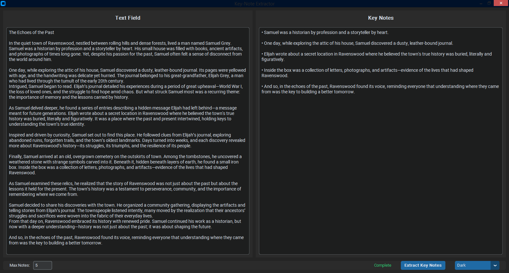
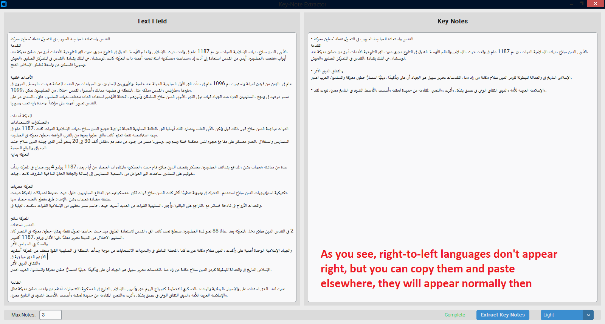

<div align="center">
  <h4 style="margin: 0; font-family: Arial, sans-serif; color: #d73a49; padding: 5px">Palestine Children, Women and Men are dying...</h4>
  
</div><br>

## About
**Key-Note Extractor** is a lightweight, offline and cross-platform desktop utility that summarizes long texts into their most important points. By using machine learning to cluster similar ideas, it identifies and extracts the core "key notes" from articles, reports, or essays, saving you the time of reading through fluff.

> It doesn't change the original text; this means it only extracts a relevant note as-is, so you are always reading the original author words.

> It is not 100% accurate, but in most cases, it should do the job. It works best with simple non-formatted text (i.e: plain text is better than a markdown code) like in the screenshots below.

> Not fully tested with languages other than English, but for now, it worked with French and Arabic too ***(Right-to-left languages won't appear well in the app, they may need to be pasted then copied elsewhere to look intact)***.

| Dark | Light |
| :---: | :---: |
|  |  |

## Usage
Simply type your long text in the `Text Field`, then press `Extract Key Notes` to see the summary in bullets.

> Note that the first extraction will take some seconds to load the model. For Windows, a powershell window may pop-up once, which is a side effect I don't know how to fix ***(unless you believe this is a hidden virus trying to get your data to my dark web server and install an unbreakable ransomware to take your money, which I'm not experienced enough to do yet)***.

## Run From Source
> Windows users can download pre-built binaries from the [releases](https://github.com/Mohyoo/Key-Note-Extractor/releases) section.
1. Download the `main.py` script from this repo.
2. Install Python requirements:
```
pip install sentence-transformers customtkinter scikit-learn numpy
```
3. Download the used small model:
```
git lfs install
git clone https://huggingface.co/sentence-transformers/all-MiniLM-L6-v2
```
4. Put the downloaded model folder beside `main.py` so it looks like this ***(files that are not mentioned below aren't needed)***:
```
|   main.py
|   
\---all-minilm-l6-v2
    |   config.json
    |   config_sentence_transformers.json
    |   model.safetensors
    |   modules.json
    |   sentence_bert_config.json
    |   special_tokens_map.json
    |   tokenizer.json
    |   tokenizer_config.json
    |   vocab.txt
    |   
    \---1_Pooling
            config.json
```
5. Run the script with `python main.py`

## Bundle from source
> Recommended to use a `venv` to avoid bundling non-necessary libraries.

You can - for example - use PyInstaller (GPL Licensed with exception):
```
python -m PyInstaller --windowed --noconsole --onedir --contents-directory . --name "Key-Note Extractor" --icon="Assets/icon.ico" main.py
```
Or use Nuitka, cx_Freeze or any bundler you prefer...
> After bundling, make sure you include the `licenses` folder and `all-minilm-l6-v2` model folder.


## Credit
The app uses the following licensed components; without them, this app wouldn't exist:
1. [Python](https://www.python.org) (PSF)
2. [all-MiniLM-L6-v2](https://huggingface.co/sentence-transformers/all-MiniLM-L6-v2) (Apache 2.0)
3. [Sentence-Transformers](https://github.com/UKPLab/sentence-transformers) (Apache 2.0)
4. [CustomTkinter](https://github.com/TomSchimansky/CustomTkinter) (MIT) <br> ***Icon taken from it too!***
5. [scikit-learn](https://github.com/scikit-learn/scikit-learn) (BSD 3-Clause)
6. [NumPy](https://github.com/numpy/numpy) (BSD 3-Clause)

> This app itself remains unlicensed (copyleft), as I didn't put much efforts in it. I only adjusted some generated code.